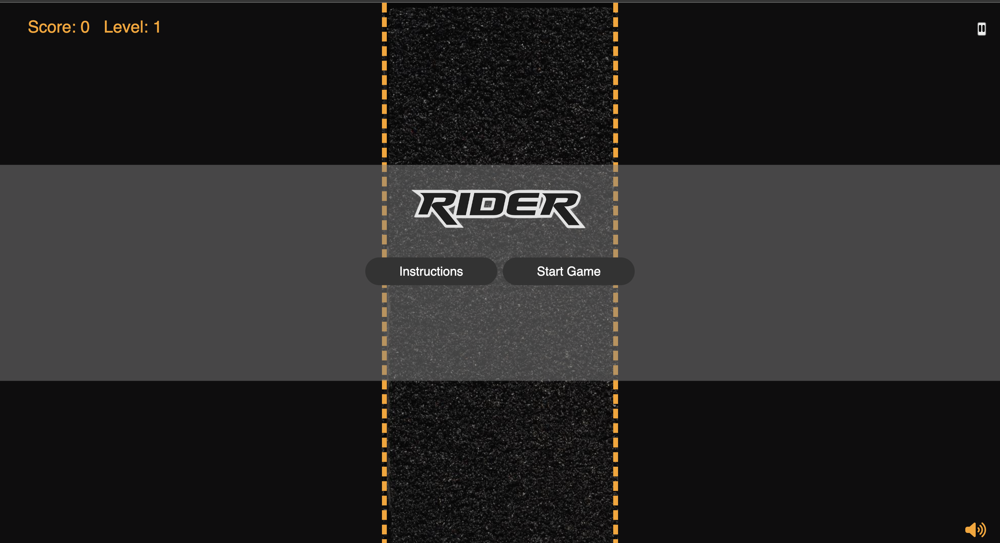

# car-driving-game

[Play the Game] (https://anitacoder.github.io/car-driving-game/)

## Description 
Rider is an exhilarating car driving game that puts your reflexes and driving skills to the ultimate test. Navigate through oncoming cars, and rank up points as you speed towards new levels. With each passing milestone, the game gets harder, and faster and requires you to stay sharp and focused.

## Features 

- **Dynamic Enemy Movement**: Enemies move downwards, creating a constant challenge and requiring quick reflexes to navigate through. 
- **Increasing Difficulty**: Experience high-speed car driving with smooth and responsive controls that put your reflexes to the test.
- **Sound Effects**: Background music for an engaging experience.
- **Score counts**: Earn points by moving the car and advancing to new levels. 
- **Pause Button**: Pause button to play and pause the game.
- **Game over banner**: Shows the new score and the high score and the game over text message when the game ends.

## Technologies Used

- **HTML5**: Built using HTML5 for game structure and integrated audio elements that enhance the overall gaming experience.
- **CSS3**: Utilizes CSS3 for styling the game elements including the start and instruction buttons and enemies
- **JavaScript** : 